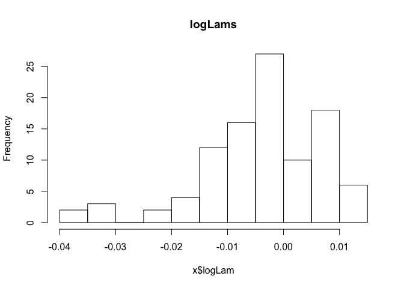
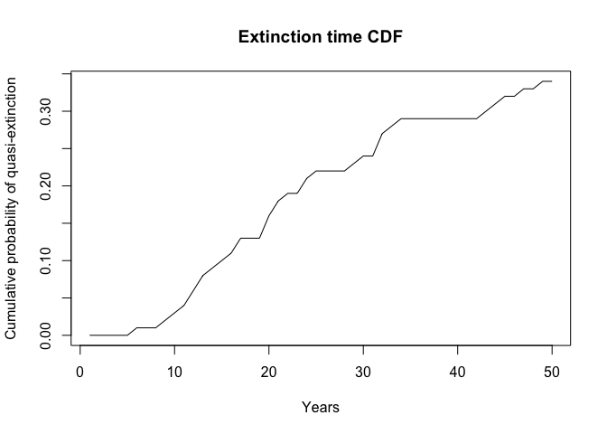
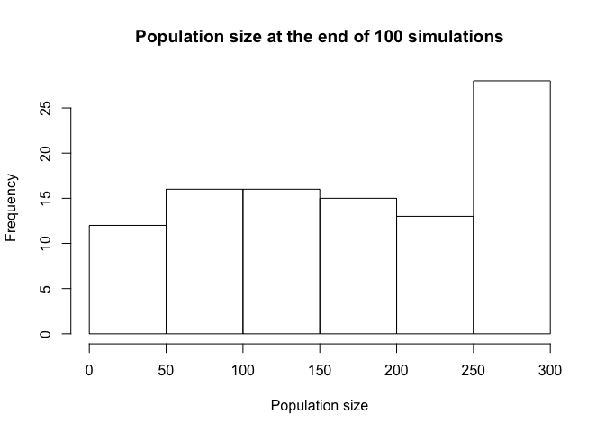

# msPVA : An R implementation of count-based multi-site population viability analysis
[](https://zenodo.org/badge/latestdoi/19481/cmartin/msPVA)

This package implements a stochastic simulation for a count-based multi-site population viability analysis as described in chapter 11 of Quantitative Conservation Ecology (Morris & Doak, 2002).

Code is highly inspired from the MatLab implementation described in the book.

## Installation
You have two options here.

### Install package from github.com
This allows you to easily install updates, have access to the function help files etc.

```r
library(devtools)
devtools::install_github("cmartin/msPVA")
library(msPVA)
```

### Or you download the source file and run it directly
In this case, you need download [the raw R file](https://raw.githubusercontent.com/cmartin/msPVA/master/R/MultisitePVA.R)
and then execute : 

```r
source("MultisitePVA.R")
```
This is a quicker, but dirtier way!

## Try some examples

With the same Clapper rail data as in Morris & Doak

### Definining parameters manually : 


```r
res <- simulate_ms_pva(
 leaving_prob = 0.2,
 reaching_prob = 0.5,
 growth_rate_means = c(0.043, -0.002, 0),
 growth_rate_vars = c(0.051, 0.041, 0.051),
 initial_pops = c(70, 26, 33),
 growth_rate_corrs = {matrix(
   c(	1.000,	0.995,   0.896,
   0.995,	1.000,   0.938,
   0.896,	0.938,   1.000),
   nrow = 3,
   ncol = 3,
   byrow = TRUE
 )},
 K = c(286, 60, 58),
 quasi_extinction_thresholds = c(20, 20, 20),
 n_years = 50,
 n_runs = 100,
 with_progress_bar = FALSE

)

print(res)
```

```
This is the deterministic lambda value :  1.0319573564599
And this is the mean stochastic lambda :  0.998678726848634
Below is mean and standard deviation of log lambda :
-0.00139524703737162 0.0121742843918934
```

```r
hist(res)
```

 

```r
plot(res)
```

 

### Or ask the package to calculate most of them automatically from a time-series : 
With a two-populations polar bear time series from [Stirling et al. 2004](http://arctic.journalhosting.ucalgary.ca/arctic/index.php/arctic/article/view/479/509)

```r
params <- calculate_params_from_file(
 system.file("extdata", "PolarBear_Stirling2004.csv", package = "msPVA")
)
```

```
Warning in calculate_params_from_file(system.file("extdata", "PolarBear_Stirling2004.csv", : There were gaps in the time series.
  Mean and variance were computed by linear regression.
  Correlation matrix was calculated assuming regular intervals.
```

```r
res <- do.call(
 "simulate_ms_pva",
 c(
   params,
   list(
     K = c(300,200),
     leaving_prob = 0.1,
     reaching_prob = 0.7,
     quasi_extinction_thresholds = c(20, 20),
     n_years = 50,
     n_runs = 100,
     with_progress_bar = FALSE
   )
 )
)
print(res)
```

```
This is the deterministic lambda value :  1.05786392886293
And this is the mean stochastic lambda :  0.990811292911251
Below is mean and standard deviation of log lambda :
-0.00929215177447494 0.0111338621670798
```

## Run it for a single population

```r
# From a precalculated mean log-lambdas

res <- simulate_ss_pva(
 growth_rate_means = 0.043,
 growth_rate_vars = 0.051,
 initial_pops = 70,
 K = 286,
 quasi_extinction_thresholds = 20,
 n_years = 50,
 n_runs = 100
)

print(res)
```

```
Over a 50 years span, the extinction risk of this population is 0.11
And the risk of decline is 0.17
```

```r
hist(res)
```

 

```r
# From a vector of log-lambdas
res <- simulate_ss_pva(
  log_lambdas = c(-0.0503626618483076, -0.0316522478682412, -0.205890697055539,
                  -0.0407897021414208, 0.151024474883104, -0.141017433696716, 0.105149579850484,
                  0.104087724782143, 0.18297223483855),
  initial_pops = 70,
  K = 286,
  quasi_extinction_thresholds = 20,
  n_years = 50,
  n_runs = 100
)

# Or from a vector of lambdas
res <- simulate_ss_pva(
  lambdas = c(
    0.808510638,
    0.828947368,
    1,
    1.047619048,
    0.833333333,
    1.777777778
  ),
  initial_pops = 70,
  K = 286,
  quasi_extinction_thresholds = 20,
  n_years = 50,
  n_runs = 100
)
```

## Read the book
If you are to use this package, I highly recommend that you first read chapter 11 from [Quantitative Conservation Ecology (Morris & Doak, 2002)](http://www.sinauer.com/quantitative-conservation-biology-theory-and-practice-of-population-viability-analysis.html), so you understand limitations and assumptions from the underlying model. Managing animal populations should not be taken lightly.

## Problems
Please report any bugs to the [GitHub issue tracker](https://github.com/cmartin/msPVA/issues) and write any questions to <charles.martin1@uqtr.ca>

## Citation
If this code is useful to you, please cite as : 


```
Charles A. Martin (2015). msPVA: An R implementation of count-based multi-site population viability analysis. R package version 0.0.0.9003. https://github.com/cmartin/msPVA. DOI:10.5281/zenodo.34692
```
